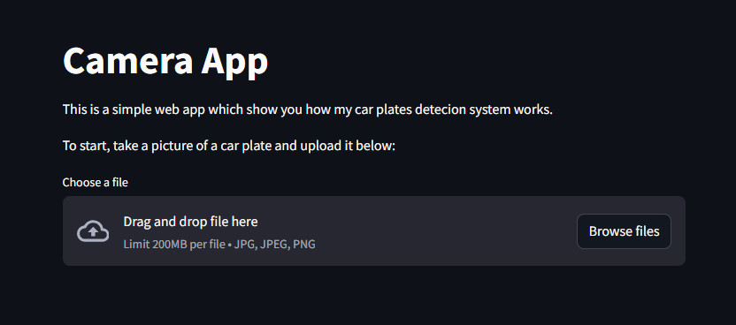
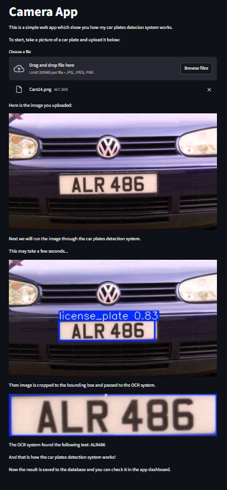
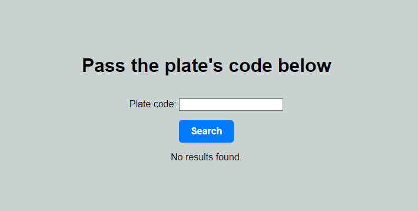
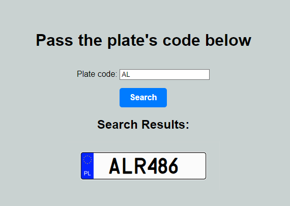
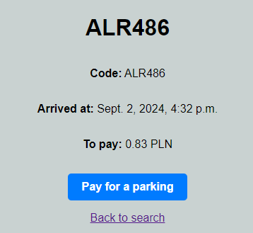
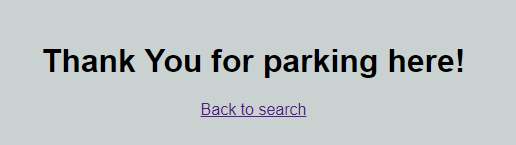

# AutoParkZone

## Describe
<p style="text-align: justify">This project simulates whole structure of software capable to handle paid parking. Fine-tuned YOLOv5 and easyOCR are used for fetching car plate from the image and read the code. Then this result is sent to the database with exact timestamp of arriving at the parking. After the payment exact timestamp of transfer is sent to database. After leaving the parking record is moved to another table which is a base to build dashboard.</p>

## Contents

1. [Car plates detection system](#first),
    - [Re-training YOLOv5](#yolo),
    - [Tuning easyOCR](#ocr),
    - [App prototype](#app)
2. [Payments app](#second),
3. Dashboard.

### 1. Car plates detection system
<a name="first"></a>
<p style="text-align: justify"> This problem was solved with usege two object detection models: <a href="https://github.com/ultralytics/yolov5">YOLOv5</a> and <a href="https://www.jaided.ai/easyocr/">easyOCR</a>. First one is capable to detect and recognize 80 diffrent classes including cars, animals etc. YOLOv5 is distinguished by it's accuracy and high efficiency performence. Second one allows to detect text from the image.</p>

#### Re-training YOLOv5
<a name="yolo"></a>
<p style="text-align: justify">Althrough YOLOv5 is really powerful model, it doesn't recognize car licence plates. In this case re-training model was necessary. I've used <a href="https://www.kaggle.com/datasets/andrewmvd/car-plate-detection/data">Car License Plate Detection Dataset</a> to learn model how to detect plates. Whole process is nested in <a href="https://github.com/lucasosiewicz/AutoParkZone/blob/main/notebooks/fine-tune%20model.ipynb">`notebooks\fine-tune model.ipynb`</a> and it's performence was checked in <a href="https://github.com/lucasosiewicz/AutoParkZone/blob/main/notebooks/testing%20new%20model.ipynb">`notebooks\testing new model.ipynb`</a>.</p>

#### Tuning easuOCR
<a name="ocr"></a>
<p style="text-align: justify">After solving plate detection problem next challange was to recognize text from the image. Perfect tool for that was easyOCR which handle with a lot of difficult problems. It may be confusing why I re-trained YOLO when easyOCR can detect text without any problem. Here occures first disadvantage of easyOCR - this model is to much efficient. Let's imagine the situation when arriving car has a sticker with some text - it would be detected and passed to the system too. Usage of YOLO allows to detect plate and cut the image around it. That's the easiest way to avoid errors. EasyOCR was constrained to detect only letters and digits to avoid passing some unallowed characters in the output. Another problem that occures was a gap between first and second part of plate's code. To handle that parameter `width_ths` was setted to 0.7.</p>

#### App prototype
<a name="app"></a>
To show more empirically how actually system works I've builded an app prototype which allows to load Your own image and guides You through the whole process. To open web app follow instructions below:

```
cd camera_app
streamlit run app.py
```

After that You should see UI like below:



After passing an image to the application You will see whole process step by step:



<p style="text-align: justify">You might notice that the result was send to the database and it's right! Saved result is going to the main database of django website.</p>


### 2. Payment app
<a name="second"></a>
To open website follow instructions below:

```
cd payment_app
python manage.py runserver
```

You should see the website intefrace like below:


<p style="text-align: justify">This absolutely simple UI allows You to pay for Your visit at the parking. In the prototype I passed an image with code ALR486. Let's find it out:</p>



<p style="text-align: justify">It works! As You can see, I didn't pass the whole code. Information passed in the form is looking for similiar codes and display all of them. I had only one code like that so only one has been displayed. You can click on the right code and You'll be moved to the details section:</p>



<p style="text-align: justify">You can see informations like Your plate's code, exact time when You scanned Your image and cost of the parking. You can pay for a parking by clicking on the button or You can go back to the main page if You accidentally clicked wrong plate. After button click You'll see an information like below:</p>



After that Your code will be removed to another table which is core of a dashboard.